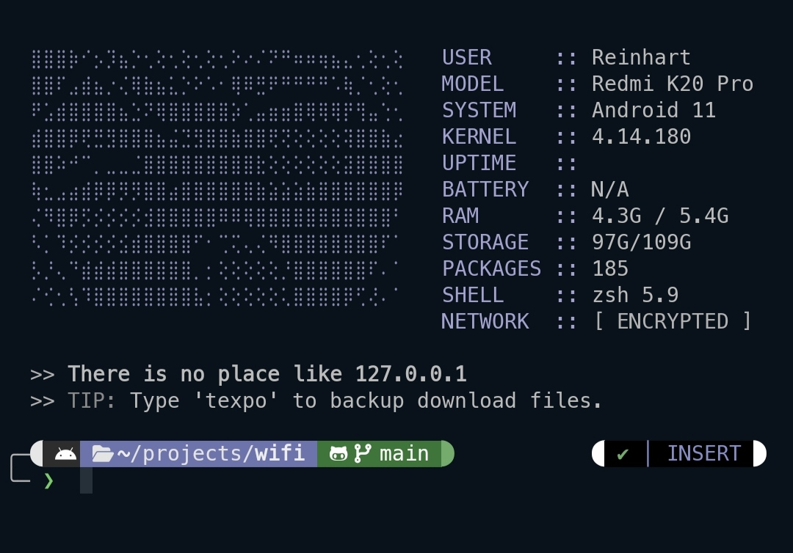

# My-termux-zsh

<p align="center">
  
</p>

<p align="center">
  <a href="https://github.com/Worthiit/My-termux-zsh/raw/main/audio/welcome.mp3">
    
  </a>
</p>


​I was tired of manually installing Zsh, fonts, themes, and plugins every time I reset Termux. I wanted a professional and easy setup that installs everything in one command without wasting storage on a heavy Termux desktop. This is built for personal use, but if you want a terminal that actually fills the gap between Android hardware and a Linux workstation, this is for you my buddy.
So I built this.

Make sure to download termux and termux api cuz most of my scripts depends on em ( i use GitHub version for both )

**It Includes:**
- **Zsh & Zinit**: High-speed shell environment using Zinit for asynchronous plugin loading
- **Powerlevel10k & Meslo NF**: prompt theme paired with a full Nerd Font for icon support 
- **Auto-Suggestions & Syntax Highlighting** (The cheat codes)
- **Font, Color & Prompt Switchers** (For customization) setlook to change font and setstyle for colours 
- **Simple Dashboard**: A custom MOTD dashboard with live system stats and a hot-swappable ASCII art system (kawai).
- **Android core**: Native Android integration (amv) to control system settings, hardware, and activities from the CLI which is originally `am` activity manager but i wanted something better
- **The Arsenal (ninja):** A CLI manager to bulk-install 30+ tools like apktool, nmap, and yt-dlp. ( haven't added 50+ yet , xaxa )
- **Atuin & Zoxide**: SQLite-backed infinite command history and smart directory jumping.
- **Visual Tools**: ftext for string searching with previews and peek for fzf+bat file inspection.
- **File & App Utilities**: warp for visual storage bridging and snatch for pulling installed APKs


## Installation


One line command cuz why not ?

```bash
curl -fsSL https://raw.githubusercontent.com/Worthiit/My-termux-zsh/main/Myzsh.sh -o setup.sh && bash setup.sh
```

### Features & my Shortcuts (Old + New)

| Command | What it actually does |
| :--- | :--- |
| `up` | Force-refreshes the system. Updates and upgrades in one tap. |
| `setname <NAME>` | Swaps the username shown on your welcome screen. |
| `setlook` | Font Switcher. Changes terminal fonts instantly. |
| `setstyle` | Color Switcher. Picks from 100+ terminal color schemes. |
| `setprompt` | Re-runs the Powerlevel10k setup to change your prompt look. |
| `setbg <file>` | Set a custom wallpaper (or `setbg --default` to reset). |
| `ninja` | The Arsenal. Menu to bulk-install 50+ God-tier tools like `apktool`, `nmap`, etc. |
| `amv` | **Android Core:** Opens the menu for WiFi, Home, Brightness, and Hardware settings. |
| `amv a` | **Pro Logic:** Add your own custom Android activity path to the menu on the fly. |
| `kawai` | ASCII Art Selector. Pick your MOTD look from `~/.termux/ascii/` with a live preview. |
| `ftext <query>` | **Full Search:** Finds text inside any file in your project with a syntax-highlighted preview. |
| `snatch` | **APK Hijacker:** Scans your phone, grabs a raw APK, and pulls it into your current folder. |
| `warp in` | Opens a visual picker in `/sdcard/` to pull files into Termux. |
| `warp out` | Opens a visual picker here to push files directly to your Android Downloads. |
| `peek` | Quick look. `fzf` + `bat` to see inside files without actually opening them. |
| `host <port>` | Starts a local web server right here. Default is 8080. |
| `beam` | The Web Terminal. Lets you access your Termux from a PC browser with custom keys. incomplete |
| `scrub` | deletes cache, temp files, and installer garbage to save space. |
| `rep <file>` | Map clipboard content to a new command or variable. |
| `runclip` | Grabs code from your clipboard and runs it as a Python script instantly. |
| `copyclip <file>` | Dumps file content straight into your Android clipboard. |
| `reveal` | Network check. Shows your Local IP and Public IP in one go. |
| `mkcd <dir>` | Makes a folder and jumps inside immediately. |
| `extract <file>` | file extraction. Works for `.zip`, `.tar.gz`, `.rar`, `.7z`, etc. |
| `findbig` | Scans for any file over 100MB that's eating your storage. |
| `z <dir>` | Smart jump. Remembers where you've been so you don't have to type paths. |
| `..` / `...` | Fast navigation to go back one or two levels. |
| `q` / `c` | Fast exit and fast clear. |


** For all the available commands head to ...( I'll add a md later , rn I'm lazy )**


### 🛠 The Arsenal (Tool Manager , completed)
I built a CLI interface to let you instantly bulk-install 30+ God-Tier Termux tools (like `apktool`, `lazygit`, `tmate`, `nmap`, etc.) without typing `pkg install` over and over.

Type this to open the menu:
```bash
ninja
```
It installs what you pick and show you a cheat sheet on how to use them immediately.( still incomplete )

### The ASCII System (Kawai)
I moved away from hardcoded art of motd to a different path, Now you can hot-swap your MOTD visuals.
 * Art Location: ~/.termux/ascii/
 * Adding Art: Drop any .txt file into that folder or run `kawai -a <name>` and deop the art then press ctrl + D ( capital D )
 * Execution: Type `kawai` and use arrow keys to preview. Hit Enter to swap the ARCII In MOTD.

# beam  ( Incomplete cuz of ahh , nvm )
*Type beam to start a local web server. It provides a URL that you can open on any device on the same network to get a full-screen, premium web terminal with custom keys and zoom support.*

 # Warp
 * `warp in`: Open a visual file manager in /sdcard/ to pull files into your current folder.
 * `warp out`: Open a visual file manager here to push files directly to your Android Downloads.

# Peek
*Instead of opening a file to check a token or a line of code, run peek. It opens an fzf search with a side-window preview that highlights code syntax using bat. you can do the same thing with cat too*
 

###  Automated System Tricks
I automated the annoying manual stuff in `.zshrc`.
- **Auto-LS:** Just `cd` into a directory, and it will automatically list all files visually using `eza`.
- **`mkcd <folder>`:** Creates a folder and instantly jumps into it.
- **`extract <file>`:** won't needa remember flags anymore , drop any `.tar.gz`, `.zip`, `.rar`, or `.bz2` into it, and it will figure out the right command to extract it automatically ( hope so )
- **Auto-LS:** Just cd into a directory, and it lists files visually using eza.
- **`atuin`:** Search through thousands of past commands instantly without clicking Up a hundred times.
- ** `scrub`:** scrub keeps your storage lean by removing setup trash and cache

  
### Summary of Changes ( i mean i just updated again cuz old one sucks )

1.  `motd.sh` now uses `dpkg` instead of `pkg`. It will load instantly.
2.  **Async:** `.zshrc` now uses `wait"0"` for heavy plugins, so the prompt appears faster
3.  **Style:** Added `setlook` command. Type it to change fonts anytime, now don't tell me that you could do it with Termux setting too ik that buddy
4. **Private:** Made all my other repos private cuz yeah it was necessary
5. **Mess:**  i made a mess while trying to make it better 

## Credits
These scripts are mine which are simple code/commands, there is no need to even take credit BUT
The font (`setlook`) , color (`setstyle`) and termux-change-repo (`setrepo`) management scripts are modified versions of tools (termux-nf , termux-colors & termux-fastest-repo) originally created by **Md arif** ( ig yes ) 

- Original Project: [termux-desktop](https://github.com/sabamdarif/termux-desktop)
- Author: [sabamdarif](https://github.com/sabamdarif)

Respect to the open-source community.
